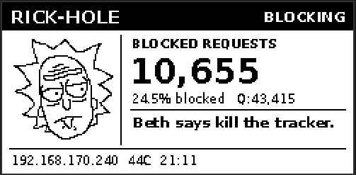
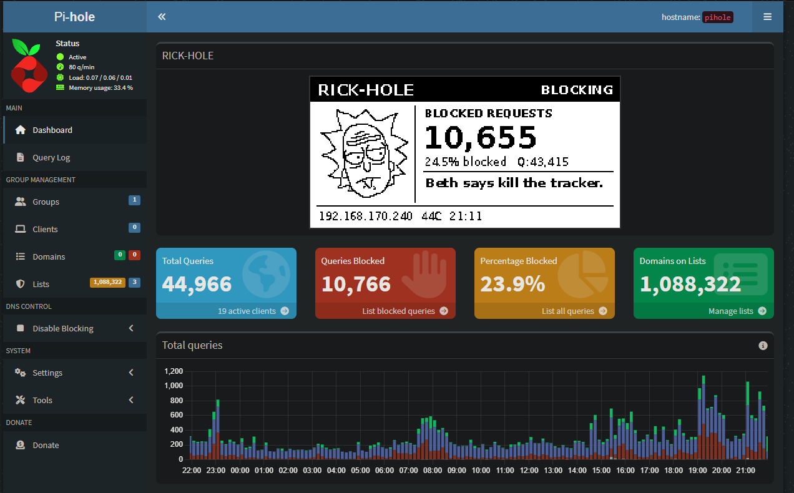
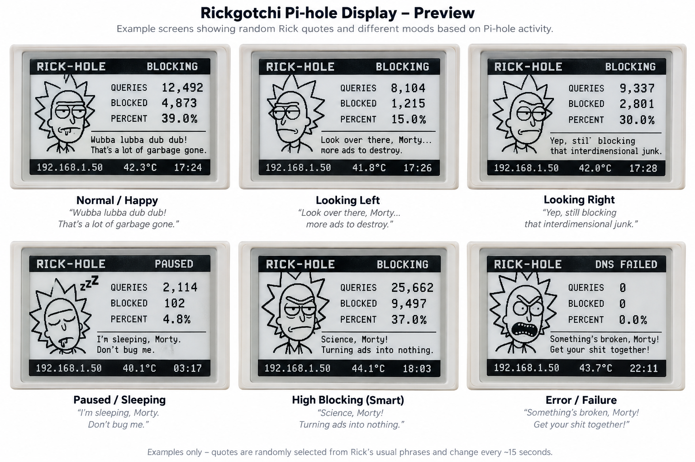

<div align="center">

# RICK-HOLE

**A Rick-themed Pi-hole v6 dashboard for the Waveshare 2.13-inch V4 e-paper HAT.**

Live Pi-hole stats, mood-based faces, rotating quotes, system temperature, network info, and an optional live RICK-HOLE card inside the Pi-hole web dashboard.


</div>

> [!NOTE]
> Fan project. Not affiliated with Pi-hole, Waveshare, Adult Swim, Warner Bros. Discovery, or the Rick and Morty rights-holders.

---

## Why the hell does this exist?

This whole thing started after I set up a **Pwnagotchi**. I liked having a little screen sitting on the Pi showing live information, so when I decided to build and test my own **Pi-hole**, I was left looking at the e-paper display thinking: *well, I might as well make the bastard useful.*

The original idea was simple — use the screen to monitor Pi-hole data in the same spirit as a Pwnagotchi: live stats, activity, status and whatever else the Pi was getting up to. Then I decided a boring network monitor wasn't enough.

The obvious companion was **Rick**.

So now he sits there watching the network, changing mood depending on what's happening, reporting the stats, and swearing at me all day while Pi-hole murders ads and trackers in the background.

Was any of this necessary? Absolutely not.

Did that stop me? Also absolutely not.

**Enjoy.**

---

## Actual RICK-HOLE Preview

These screenshots are taken from the **real running RICK-HOLE installation** rather than a mock-up, so the layout below matches the current 250×122 display.

<p align="center">
  
</p>

The live screen includes:

- `RICK-HOLE` title and current Pi-hole state
- mood / face artwork on the left
- large **BLOCKED REQUESTS** counter
- blocked percentage and total query count
- rotating quote / status line
- LAN IP, Raspberry Pi temperature and current time

---

## Pi-hole Dashboard Integration

RICK-HOLE can be embedded directly into the normal **Pi-hole v6 dashboard**. This is an actual screenshot of the integration running on the project:

<p align="center">
  
</p>

The dashboard card displays the same live frame being sent to the e-paper display and refreshes automatically every **15 seconds**.

The browser preview is written to:

```text
/var/www/html/admin/img/rick-hole-live.png
```

The PNG is saved **before** the physical-display rotation is applied, so a Pi installed with the e-paper panel rotated 180° can still show an upright dashboard preview.

---

## Face / Mood Examples

These are examples from the **actual face artwork used during development**, including the three original face images from the project and the live face currently shown on the Pi-hole dashboard.

<table>
  <tr>
    <td align="center"><strong>Original Face 1</strong><br></td>
    <td align="center"><strong>Original Face 2</strong><br></td>
    <td align="center"><strong>Original Face 3</strong><br></td>
    <td align="center"><strong>Live Dashboard Face</strong><br></td>
  </tr>
</table>

RICK-HOLE is designed around multiple moods / states:

| Asset | Purpose |
|---|---|
| `BORED.png` | Low blocking / idle |
| `HAPPY.png` | Normal blocking |
| `SMART.png` | Increased blocking activity |
| `EXCITED.png` | Busy blocking activity |
| `INTENSE.png` | Very high activity |
| `ANGRY.png` | Extreme activity |
| `SLEEP.png` | Pi-hole paused |
| `BROKEN.png` | API / DNS failure |
| `LOOK_L.png` | Animation frame |
| `LOOK_R.png` | Animation frame |

### Earlier compiled mood preview

During development I also put together this six-screen mood sheet to visualise how different Rick expressions, states and quotes could work together. **This is an earlier concept render, not the exact current screen layout** shown above.

<p align="center">
  
</p>

The runtime face pack itself is not included as a complete redistributable artwork pack. The images above are documentation / project examples. If you're building your own installation, use compatible **75×75 PNG** face assets in `assets/hologram/` and make sure you have the right to redistribute any artwork you publish.

---

## Screen Layout

The current live screen layout is shown below at its original aspect ratio:

<p align="center">
  
</p>

The display is designed for the Waveshare **2.13-inch V4** panel at **250×122** in landscape orientation.

---

## Features

- Pi-hole **v6 API** integration
- Native **250×122** monochrome layout
- Live blocked requests, block %, total queries, LAN IP, CPU temperature and time
- Mood selection based on Pi-hole blocking activity
- Animated left/right face movement using partial e-paper refreshes
- Periodic full refreshes to reduce ghosting
- Editable JSON quote banks
- Cleaner default quote pack
- Optional profanity-heavy `quotes/unhinged.json`
- Optional live Pi-hole web-dashboard card
- Automatic startup through `systemd`
- Pi-hole API password stored outside Git
- Local-only Pi-hole API access

---

## Hardware / Software

### Required

- Raspberry Pi
- Waveshare **2.13-inch e-Paper HAT V4**
- Pi-hole v6
- Raspberry Pi OS / Debian-family Linux
- Python 3

The installer downloads Waveshare's official `e-Paper` repository and copies the required `waveshare_epd` driver locally.

---

## Repository Layout

```text
Ricks-Hole/
├── pihole_eink.py
├── install.sh
├── requirements.txt
│
├── assets/
│   └── hologram/
│
├── config/
│   └── pihole-eink.example.json
│
├── dashboard/
│   ├── card.html
│   └── rick-hole.js
│
├── docs/
│   └── images/
│
├── quotes/
│   ├── default.json
│   └── unhinged.json
│
├── scripts/
│   ├── configure.sh
│   ├── copy-assets-from-live-install.sh
│   ├── install-dashboard.sh
│   └── uninstall-dashboard.sh
│
└── systemd/
    └── pihole-eink.service
```

---

## Face Assets

The repository intentionally does **not** include copyrighted character artwork.

The application expects ten **75×75 PNG** files in:

```text
assets/hologram/
```

Expected filenames:

```text
HAPPY.png
LOOK_L.png
LOOK_R.png
BORED.png
SMART.png
EXCITED.png
INTENSE.png
ANGRY.png
SLEEP.png
BROKEN.png
```

If you already have a working RICK-HOLE installation, clone this repository onto that Pi and run:

```bash
./scripts/copy-assets-from-live-install.sh
```

That copies the existing faces from:

```text
/opt/pihole-eink/assets/hologram/
```

into this repository's `assets/hologram/` folder.

> [!WARNING]
> Review the licence / redistribution rights of any third-party artwork before publishing it. A private repository is the safer option when rights are unclear.

---

# Installation

## 1. Clone RICK-HOLE

```bash
git clone https://github.com/moochy101/Ricks-Hole.git
cd Ricks-Hole
```

> If the repository is private, GitHub will require authentication before cloning.

## 2. Install

```bash
sudo ./install.sh
```

## 3. Configure Pi-hole access

```bash
sudo ./scripts/configure.sh
```

The real configuration is stored locally at:

```text
/etc/pihole-eink.json
```

It is deliberately **not stored in Git**.

## 4. Start / restart RICK-HOLE

```bash
sudo systemctl restart pihole-eink
```

## 5. Check the service

```bash
systemctl status pihole-eink --no-pager
```

You want to see:

```text
Active: active (running)
```

---

## Test the Pi-hole API

Test the Pi-hole connection without touching the physical screen:

```bash
sudo -u pihole-eink /usr/bin/python3 /opt/pihole-eink/pihole_eink.py --check
```

A successful test reports Pi-hole's current state, blocked requests and block percentage.

---

# Quote Packs

RICK-HOLE supports interchangeable JSON quote banks. The phrase shown on screen is selected from the category that matches Rick's current mood / Pi-hole state, so the display changes personality as network activity changes.

The included packs contain:

- **Default / Cleaner:** 19 phrases
- **Unhinged:** 169 phrases
- Categories: `idle`, `success`, `tech`, `exclaim`, `angry`, `sleep`, `failure`

The quote normally changes alongside the animation cycle, so Rick isn't stuck saying the same thing all day.

## Use the Unhinged Pack

```bash
sudo cp quotes/unhinged.json /etc/pihole-eink-text.json
sudo systemctl restart pihole-eink
```

## Use the Default / Cleaner Pack

```bash
sudo cp quotes/default.json /etc/pihole-eink-text.json
sudo systemctl restart pihole-eink
```

## All Included Phrases

The lists below are generated from the actual JSON quote files shipped in this repository, so these are the phrases the included packs can display.

<details>
<summary><strong>Default / Cleaner Pack — 19 phrases</strong></summary>

### Idle / Bored

- Morty, this network is boring.
- Nothing exciting to block.

### Success / Happy

- Wubba lubba dub dub!
- Another one bites the DNS.
- Blocked it, Morty.

### Tech / Smart

- Science, Morty!
- DNS is just applied science.
- Look at those queries.

### Excited

- Now we're talking!
- That's a lot of junk!
- Get schwifty with DNS!

### Angry

- Who invited all these trackers?
- Get this garbage off my network!
- Enough ads already!

### Sleep / Paused

- I'm sleeping, Morty.
- Wake me when DNS is back.

### Failure / Broken

- Something's broken, Morty!
- DNS has gone sideways.
- Check the service logs!

</details>

<details>
<summary><strong>Unhinged Pack — 169 phrases</strong></summary>

> ⚠️ Contains strong language, insults and general Rick-style abuse. That's the point.

### Idle / Bored

- Morty, this network is boring.
- Nothing exciting to block.
- Fuck me, this is boring.
- Morty, do something useful.
- Nothing to kill. Pathetic.
- This network's dead inside.
- Wake me when shit breaks.
- Morty, I'm losing brain cells.
- Even Jerry's more exciting.
- Aw geez, Rick. DNS again?
- Aw man, that's a lot of ads.
- Classic Jerry bullshit.
- Don't touch it, Jerry.
- Summer > Jerry. Obviously.
- Your telemetry bores me.
- Another pathetic request.
- Slippery Stair strikes again.
- Morty, where are my schmeckles?

### Success / Happy

- Wubba lubba dub dub!
- Another one bites the DNS.
- Blocked it, Morty.
- Blocked it, you little bitch.
- Another fucker gone.
- Eat shit, telemetry.
- Fuck off, ad server.
- Another tracker fucking dead.
- Beautiful. Fucking beautiful.
- Blocked. Deleted. Get fucked.
- DNS wins, bitch.
- Another tracker dead.
- Rick-Hole says no.
- Blocked it, dickhead.
- Another ad bites it.
- Look at me! I'm blocking shit!
- Can do! Block that bastard.
- Ooh wee! Another one blocked.
- The tracker must die.
- Blocking is preferable.
- Get squanched, ad server.
- Predictable. Blocked.
- Block that shit, bitch!
- Oh boy, here I block again.
- I just love killing trackers.
- Another clean kill.
- Rick-Hole says no, bitch.

### Tech / Smart

- Science, Morty!
- DNS is just applied science.
- Look at those queries.
- DNS science, motherfucker.
- Science, bitch. Keep up.
- Packets don't lie, Morty.
- Your DNS smells like shit.
- Look at this fucking traffic.
- I weaponised fucking DNS.
- Morty, sniff this packet.
- That's some filthy telemetry.
- Morty, sniff this.
- You smackhead, Morty.
- You're a bitch, Morty.
- Morty, don't touch that.
- Jerry could do better.
- Beth would've fixed this.
- Beth says kill the tracker.
- Meeseeks hates telemetry.
- Your DNS lacks honour.
- Telemetry is without purpose.
- Freedom starts with DNS.
- Rick would've blocked that.
- That's some fucked-up traffic.
- My gears hate this domain.
- Don't grind my fucking gears.
- Portal this shit to hell.
- Citadel DNS says fuck off.
- Wrong dimension, asshole.
- Send that tracker to C-137.
- Interdimensional bullshit.
- Change the fucking channel.
- Even aliens hate telemetry.

### Excited

- Now we're talking!
- That's a lot of junk!
- Get schwifty with DNS!
- Holy shit, Morty!
- Now we're fucking cooking!
- That's a shitload of blocks!
- Fuck yes! More garbage!
- Keep 'em coming, assholes.
- Look at that fucking counter!
- This shit's getting spicy.
- Wubba lubba fuckin' dub dub!
- Jesus Christ, Morty.
- Look at this shit, Morty.
- Rick, what the fuck?!
- Summer says block that shit.
- Gross. Fucking trackers.
- Rick, delete this garbage.
- Ads are fucking embarrassing.
- Another family disaster.
- Ooh wee, that's fucked up.
- Ooh wee, fuck that tracker.
- That domain's a real asshole.
- Let's fucking squanch this.
- Squanch that tracker!
- What the squanch is this?
- Welcome to DNS, bitch!
- Sweet dreams, bitch!
- No ads in my nightmare, bitch!
- Target acquired. Fuck it.
- Slippery Stair, save my ass.
- Use the fucking stairs, Morty.
- Watch the stairs, dumbass.
- That cost me 25 schmeckles.
- Worth every fucking schmeckle.
- Not a single schmeckle more.
- Pay me in schmeckles, bitch.
- That's 50 fucking schmeckles.
- Schmeckles well fucking spent.
- 25 schmeckles? Fucking robbery.
- Fuck DNS. I want schmeckles.
- Where are my schmeckles?

### Angry

- Who invited all these trackers?
- Get this garbage off my network!
- Enough ads already!
- Who let this shit in?
- Fuck off, trackers!
- Get this shit off my network.
- Morty, you useless bastard.
- What the fuck is this domain?
- Nope. Fuck you. Blocked.
- Telemetry can eat shit.
- I'll block your whole bloodline.
- This network is fucked.
- Nice try, telemetry.
- Fuck off, trackers.
- Nope. Blocked. Fuck off.
- Jerry fucked up the DNS.
- Jerry clicked the fucking ad.
- Even Jerry could block that.
- Jerry, you useless bastard.
- Jerry, stop touching shit.
- Existence is fucking pain.
- Make the DNS request stop!
- Slippery Stair, you bastard.
- Slippery Stair says fuck you.
- Morty, that's my last schmeckle.

### Sleep / Paused

- I'm sleeping, Morty.
- Wake me when DNS is back.
- Fuck off, I'm sleeping.
- Not now, Morty.
- Wake me when DNS dies.
- Go bother Jerry.
- I'm too drunk for this shit.
- Pause means fuck off.
- Morty, shut the fuck up.
- I-I think you broke it, Rick.

### Failure / Broken

- Something's broken, Morty!
- DNS has gone sideways.
- Check the service logs!
- Oh fuck, DNS is dead.
- You broke it, Morty.
- Everything's fucked.
- DNS shit the fucking bed.
- Well, that's fucking broken.
- Morty, fix this shit.
- Great. We're fucked.
- Check the fucking logs.
- Rick, this feels illegal.
- Something's fucked, Morty.
- Meeseeks can't fix this shit.
- This DNS is fucking cursed.

</details>


You can add, remove or rewrite phrases by editing:

```text
quotes/default.json
quotes/unhinged.json
```

or the active quote file on the Pi:

```text
/etc/pihole-eink-text.json
```

After changing the active quote file:

```bash
sudo systemctl restart pihole-eink
```

---

# Pi-hole Web Dashboard Card

Install the integrated RICK-HOLE card:

```bash
sudo ./scripts/install-dashboard.sh
```

Then open Pi-hole:

```text
http://pi.hole/admin/
```

or use your Pi-hole's LAN IP address.

The card displays the same generated RICK-HOLE frame as the e-paper screen and refreshes every 15 seconds.

## After a Pi-hole Web Update

Pi-hole updates may replace:

```text
/var/www/html/admin/index.lp
```

If the RICK-HOLE card disappears, simply run:

```bash
sudo ./scripts/install-dashboard.sh
```

again.

## Remove the Dashboard Card

```bash
sudo ./scripts/uninstall-dashboard.sh
```

---

# Configuration

Example configuration:

```json
{
  "api_url": "http://127.0.0.1/api",
  "password": "CHANGE_ME",
  "refresh_seconds": 180,
  "rotation": 180,
  "animation_seconds": 15,
  "full_refresh_every": 5,
  "web_preview_path": "/var/www/html/admin/img/rick-hole-live.png"
}
```

### `api_url`

```text
http://127.0.0.1/api
```

For security, RICK-HOLE only accepts a loopback Pi-hole API address.

### `password`

Your Pi-hole application / API password.

### `refresh_seconds`

How frequently full Pi-hole statistics are fetched.

### `rotation`

Supported values:

```text
0
180
```

### `animation_seconds`

How frequently Rick's animation / quote changes.

### `full_refresh_every`

How many partial screen refreshes occur before a full e-paper refresh.

### `web_preview_path`

Location of the generated browser PNG.

---

# Useful Commands

### Start

```bash
sudo systemctl start pihole-eink
```

### Stop

```bash
sudo systemctl stop pihole-eink
```

### Restart

```bash
sudo systemctl restart pihole-eink
```

### Enable at boot

```bash
sudo systemctl enable pihole-eink
```

### Service status

```bash
systemctl status pihole-eink --no-pager
```

### Recent logs

```bash
journalctl -u pihole-eink -n 50 --no-pager
```

---

# Troubleshooting

## Check the generated dashboard PNG

```bash
ls -lh /var/www/html/admin/img/rick-hole-live.png
```

It should have a non-zero file size.

## Python syntax check

```bash
sudo python3 -m py_compile /opt/pihole-eink/pihole_eink.py
```

## `Read-only file system`

If logs show:

```text
Read-only file system: '/var/www/html/admin/img/rick-hole-live.png'
```

make sure the systemd service allows that path:

```text
ReadWritePaths=/var/www/html/admin/img
```

Then reload and restart:

```bash
sudo systemctl daemon-reload
sudo systemctl restart pihole-eink
```

---

# Verify Pi-hole Blocking

From another device on the network:

```bash
nslookup doubleclick.net
```

A blocked result typically looks like:

```text
0.0.0.0
::
```

Watch Pi-hole queries live with:

```bash
pihole -t
```

Stop with `Ctrl+C`.

---

# Security

- Keep `/etc/pihole-eink.json` private.
- Never commit Pi-hole passwords, API credentials, tokens or private keys.
- RICK-HOLE only accepts a loopback Pi-hole API URL.
- Do not expose Pi-hole DNS port `53` directly to the public Internet.
- Do not expose the Pi-hole admin interface directly to the public Internet.
- Review third-party artwork licences before redistribution.

---

# Support RICK-HOLE

RICK-HOLE is free because apparently I make terrible financial decisions.

If it’s murdering ads, trackers, and other digital parasites on your network, feel free to throw a few quid into the experiment fund.

The money will probably go on more Pi hardware, more e-ink displays, unnecessary upgrades, and whatever other stupid idea I convince myself is “for testing.”

No pressure. The ads are getting blocked either way.

<p align="center">
  <a href="https://paypal.me/MosinIqbal98">
    
  </a>
  &nbsp;
  <a href="https://github.com/moochy101">
    
  </a>
  &nbsp;
  <a href="https://www.facebook.com/mooch.sosa">
    
  </a>
  &nbsp;
  <a href="https://www.youtube.com/@moochy101">
    
  </a>
</p>

If you’re into weird Pi builds, unnecessary automation, dodgy-looking electronics that somehow work, and other questionable projects, **follow [@moochy101](https://github.com/moochy101) on GitHub, [Mooch Sosa](https://www.facebook.com/mooch.sosa) on Facebook, or [@moochy101](https://www.youtube.com/@moochy101) on YouTube for more**.

---

# Disclaimer

RICK-HOLE is an unofficial fan project.

It is not affiliated with, sponsored by, or endorsed by Pi-hole, Waveshare, Adult Swim, Warner Bros. Discovery, Rick and Morty, or any associated rights-holder.

All third-party names, trademarks, characters and artwork remain the property of their respective owners.

---

# License

Original project code is provided under the **MIT License**.

Third-party software, artwork, trademarks and driver code retain their respective ownership and licences.

---

<div align="center">

### Repository

**https://github.com/moochy101/Ricks-Hole**

</div>
